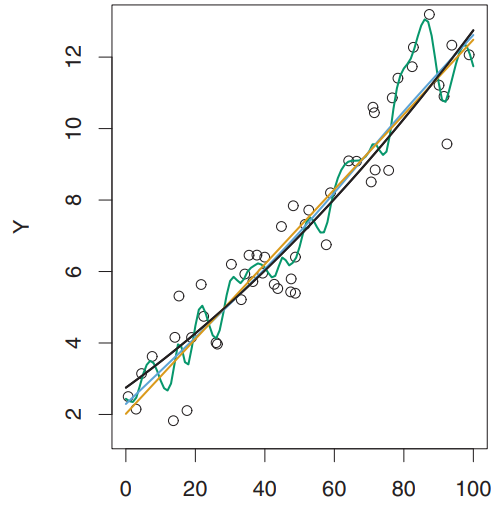
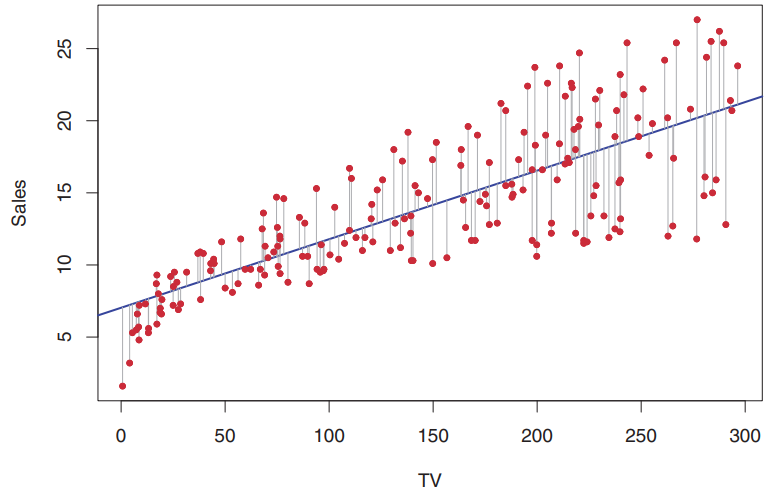
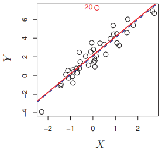

  
  ```{r setup, include=FALSE}
knitr::opts_chunk$set(echo = TRUE)
knitr::opts_chunk$set(message = FALSE)
knitr::opts_chunk$set(warning = FALSE)
```


](img/capa.png)


## Caso geral

# Statistical Learning

De forma geral, suponha que observamos uma resposta quantitativa $Y$ e $p$ preditores diferentes, $X_1, X_2, ..., X_p$. Assumimos que existe alguma relação entre $Y$ e $X = (X_1, X_2, ..., X_p)$, que pode ser escrita na forma geral:
  
$Y = f(X) + \epsilon$
  
Onde $f$ é alguma função fixa e desconhecida de $X_1, X_2, ..., X_p$ e $\epsilon$ é um termo de erro aleatório, que é independente de $X$ e tem média zero. Nessa formulação, $f$ representa as informações sistemáticas que $X$ fornece sobre $Y$. Em essência, o *Statistical Learning* se refere a um conjunto de abordagens para estimar $f$.


## Como estimamos f?

### Métodos Paramétricos
Primeiro, fazemos uma suposição sobre a forma ou formato funcional de $f$. Após a seleção de um modelo, precisamos de um procedimento que use os dados disponíveis para ajustar (*fit*) ou treinar (*train*) o modelo.

Ajustar um modelo mais flexível requer estimar um número maior de parâmetros. Esses modelos mais complexos podem levar a um fenômeno *overfitting* dos dados, o que significa que eles levam aos erros (ou ruídos) muito perto.




### Métodos não paramétricos
Os métodos não paramétricos não fazem suposições explícitas sobre a forma funcional de $f$. Em vez disso, eles buscam uma estimativa de $f$ que chegue o mais próximo possível dos pontos de dados sem ser muito irregular.

**Como regra geral, métodos paramétricos tendem a superar as abordagens não paramétricas quando há um pequeno número de análise por preditor (dimensão pequena).**


## Inferência

1. Quais preditores estão associados à resposta?
2. Qual é a relação entre a resposta e cada preditor?
3. A relação entre $Y$ e cada preditor pode ser resumida adequadamente usando uma equação linear ou a relação é mais complicada?
  
  
### Compensação entre a precisão da previsão e a interpretabilidade do modelo


## Avaliação da precisão do modelo
### Ajustando um modelo
Mean Squared Error (MSE)

$MSE = \frac{1}{n} \displaystyle \sum_{i = 1}^{n} (y_i - \hat{f}(x_i))^2$


### A compensação de viés-variância
$E(y_0 - \hat{f}(x_0))^2 = Var(\hat{f}(x_0)) + [Bias(\hat{f}(x_0))]^2 + Var(\epsilon)$
  
A Equação nos diz que, a fim de minimizar o erro de teste esperado, precisamos selecionar um método que atinja simultaneamente **baixa variância e baixo viés**. Observe que a variância é inerentemente uma quantidade não negativa e a tendência ao quadrado também é não negativa. Portanto, vemos que o teste esperado MSE nunca pode ficar abaixo de $Var(\epsilon)$, o erro irredutível.

- **Variância**: como $\hat{f}$ pode mudar se estimarmos usando diferentes conjuntos de dados de treino
- **Viés (bias)**: Erro que é necessário pela aproximação do problema real. Em um conjunto de pontos altamente não linear, uma regressão linear nunca conseguirá obter um bom ajuste, ou seja, possui um alto viés.


# Regressão linear
## Estimando os coeficientes
Critério dos quadrados mínimos para ajustar uma reta

$Min\ S_r(\beta_0, \beta_1) = Min \displaystyle \sum_{i = 1}^{n} (y_i - (\beta_0 + \beta_1x_i))^2$
  
Condições para o mínimo:
  
$\frac{\partial S_r}{\partial \beta_0} = \displaystyle \sum_{i = 1}^{n} 2(y_i - (\beta_0 + \beta_1x_i))(-1) = 0$
  
$\frac{\partial S_r}{\partial \beta_1} = \displaystyle \sum_{i = 1}^{n} 2(y_i - (\beta_0 + \beta_1x_i))(-x_i) = 0$
  
Pode acontecer que as colunas de $X$ não sejam linearmente independentes. Isso ocorreria, por exemplo, se duas das entradas estivessem perfeitamente correlacionadas, (por exemplo, $x_2 = 3x_1$). Então $X^T X$ é singular e os coeficientes de mínimos quadrados $\beta$ não são definidos de forma única. Uma maneira natural de resolver a representação não única é recodificando e/ou **eliminando colunas redundantes em $X$**.

## Caso geral
*[Algoritmos Numéricos, profa Lúcia Catabriga](http://www.inf.ufes.br/~luciac/cn/calc_num.html)*

Problema com $n$ experimentos e $m$ parâmetros:

$y = a_1 g_1(x) + a_2 g_2(x) + \cdots + a_m g_m(x) + \epsilon$

Min $S_r$ = Min $\sum\limits_{k=1}^n (\, y_k - (a_1 
g_1(x_k) + a_2 g_2(x_k) + \cdots + a_m g_m(x_k)) \,)^2$

Condições de mínimo: $\frac{\partial S_r}{\partial a_1} = \frac{\partial 
S_r}{\partial a_2} = \cdots = \frac{\partial S_r}{\partial a_m} = 0$

onde $S_r = S_r(a_1,a_2,\cdots,a_m)$.

\begin{eqnarray*}
 \frac{\partial S_r}{\partial a_1} &=& \sum\limits_{k=1}^n 2(y_k - (\, a_1 
g_1(x_k) + a_2 g_2(x_k) + \cdots + a_m g_m(x_k)) \,) (-g_1(x_k)) = 0 \\
  \frac{\partial S_r}{\partial a_2} &=& \sum\limits_{k=1}^n 2(y_k - (\, 
a_1 g_1(x_k) + a_2 g_2(x_k) + \cdots + a_m g_m(x_k)) \,) (-g_2(x_k)) = 0 \\
 \vdots && \\
\frac{\partial S_r}{\partial a_m} &=& \sum\limits_{k=1}^n 2(y_k - (\, 
a_1 g_1(x_k) + a_2 g_2(x_k) + \cdots + a_m g_m(x_k)) \,) (-g_m(x_k)) = 0
\end{eqnarray*}

\azz{Equações Normais} (sistema simétrico $m \times m$):
\[
\begin{bmatrix}
 \sum\limits_{k=1}^n g_1 g_1 & \sum\limits_{k=1}^n g_1 g_2 & \cdots & 
 \sum\limits_{k=1}^n g_1 g_m \\
 \sum\limits_{k=1}^n g_2 g_1 & \sum\limits_{k=1}^n g_2 g_2 & \cdots & 
 \sum\limits_{k=1}^n g_2 g_m \\
   &    &  \ddots   &   \\
\sum\limits_{k=1}^n g_m g_1 & \sum\limits_{k=1}^n g_m g_2 & \cdots & 
\sum\limits_{k=1}^n g_m g_m
\end{bmatrix}
\begin{bmatrix}
a_1 \\ a_2 \\  \\ \vdots \\ a_m
\end{bmatrix}
\begin{bmatrix}
\sum\limits_{k=1}^n g_1 y_k \\ \sum\limits_{k=1}^n g_2 y_k \\ \vdots \\ 
\sum\limits_{k=1}^n g_m y_k
\end{bmatrix}
\]

\vspace*{12pt}
onde $\;\; g_i = g_i(x_k), \,\,\, i = 1,2, \cdots, m$

Se $\bar{g_1}, \bar{g_2}, \cdots, \bar{g_m}$ formam um conjunto 
\azz{linearmente independente} 

\vspace*{6pt}
$\Rightarrow$ que o determinante do sistema normal é diferente de 
zero 

\vspace*{6pt}
$\Rightarrow$ que o sistema tem solução única. 

\vspace*{6pt}
Além disso, demonstra-se que que esta solução é o mínimo de 
$S_r(a_1,a_2,\cdots,a_m)= \sum\limits_{k=1}^n (\, y_k - (a_1 
g_1(x_k) + \cdots + a_m g_m(x_k)) \,)^2$.
\[
\bar{g_j} = 
\begin{bmatrix}
 g_j(x_1) \\ g_j(x_2) \\ \cdots \\ g_j(x_n)
\end{bmatrix},
\;\;\;\; j = 1,2, \cdots ,m
\]


## Avaliando a precisão das estimativas de coeficiente

Lembre-se que assumimos a existência de uma relação verdadeira (e linear) entre $X$ e $Y$ da forma $Y = \beta_0 + \beta_1 X + \epsilon$.

Aqui $\beta_0$ é o termo de interceptação, ou seja, o valor esperado de $Y$ quando $X = 0$, e $\beta_1$ é a inclinação, o aumento médio em $Y$ associado a um aumento de uma unidade em $X$.


Podemos nos perguntar quão próximos $\beta_0$ e $\beta_1$ estão dos verdadeiros valores. Para calcular os erros padrão associados a $\beta_0$ e $\beta_1$, usamos as seguintes fórmulas para os **erros padrão**:

$SE(\hat{\beta_0})^2 = \sigma^2 \left[\frac{1}{n} + \frac{\bar{x}^2}{\sum_{i=1}^n(x_i - \bar{x}^2)} \right]$

$SE(\hat{\beta_1})^2 = \sigma^2 \left[\frac{\sigma^2}{\sum_{i=1}^n(x_i - \bar{x}^2)} \right]$

A Equação também nos diz como esse desvio diminui com $n$: **quanto mais observações tivermos, menor será o erro padrão**.

Os erros padrão também podem ser usados para calcular os **intervalos de confiança**. Um intervalo de confiança de $95\%$ é definido como um intervalo de valores de modo que, com $95\%$ de probabilidade, o intervalo conterá o verdadeiro valor do parâmetro. O intervalo é definido em termos de limites inferior e superior calculados a partir da amostra de dados. Para regressão linear, o intervalo de confiança de $95\%$ para $\beta_0$ e $\beta_1$ assume aproximadamente a forma

$\hat{\beta_1} \pm 2SE(\hat{\beta_1})$

Ou seja, há aproximadamente $95\%$ de chance de que o intervalo $[ \hat{\beta_1} - 2SE(\hat{\beta_1}),\ \hat{\beta_1} + 2SE(\hat{\beta_1})]$ contenha o valor verdadeiro de $\beta_1$.

Os erros padrão também podem ser usados para realizar **testes de hipótese** sobre os coeficientes. O teste de hipótese mais comum envolve testar a **hipótese nula** de

$H_0$: Não há relação entre $X$ e $Y$.

*versus* a hipótese alternativa

$H_\alpha$: Existe alguma relação entre $X$ e $Y$.

já que se $\beta_1 = 0$ então o modelo linear se reduz a $Y = \beta_0 + \epsilon$, e **$X$ não está associado a $Y$**. Para testar a hipótese nula, precisamos determinar se $\hat{\beta_1}$, nossa estimativa para $\beta_1$, está suficientemente longe de zero para que possamos ter certeza de que $\beta_1$ é diferente de zero. Quão longe é o suficiente? Na prática, calculamos a $t$-estatística, dada por

$t = \frac{\hat{\beta_1} - 0}{SE(\hat{\beta_1})}$

que mede o número de desvios padrão que $\hat{\beta_1}$ está longe de $0$.

Consequentemente, é simples calcular a probabilidade de observar qualquer valor igual a $|t|$ ou maior, assumindo $\beta_1 = 0$. Chamamos essa probabilidade de $p$-valor. O interpretamos da seguinte maneira: um $p$-valor pequeno indica que é improvável que se observe uma associação substancial entre o preditor e a resposta devido ao acaso, **na ausência de qualquer associação real**.

**Portanto, se vemos um $p$-valor pequeno, podemos inferir que há uma associação entre o preditor e o resposta, e rejeitamos a hipótese nula**.

|                         | Coefficient | sdt. error | t-statistic | p-value  |
|-------------------------|-------------|------------|-------------|----------|
| Intercept ($\hat{\beta_0}$)   | 7.0325      | 0.4578     | 15.36       | < 0.0001 |
| TV ($\hat{\beta_1}$)          | 0.0475      | 0.0027     | 17.67       | < 0.0001 |
Table: Coeficientes do modelo de mínimos quadrados para uma regressão entre as variáveis *Sales* e *TV*, do dataset *Advertising*. Um aumento de $1.000 no orçamento de publicidade na TV está associado a um aumento nas vendas em cerca de 50 unidades (Lembre-se de que a variável *Sales* está em milhares de unidades e a variável *TV* está em milhares de dólares)

Na Tabela, note que os coeficientes $\hat{\beta_0}$ e $\hat{\beta_1}$ são bem maiores que seus erros padrão, o que faz com que a $t$-statística seja grande também, tornando o $p$-valor pequeno. Esse $p$-valor pequeno para a interceptação indica que podemos rejeitar a hipótese nula de que $\hat{\beta_0} = 0$, e um $p$-valor um pequeno para *TV* indica que podemos rejeitar a hipótese nula de que $\hat{\beta_1} = 0$. Rejeitando a hipótese nula, permite-nos concluir que existe uma relação entre as variáveis *Sales* e *TV*.




## Acessando a acurácia do modelo
### Erro Residual Padrão (RSE)

A grosso modo, é o valor médio que a resposta desviará da regressão verdadeira.

$RSE = \sqrt{\frac{1}{n-p-1}RSS}$

$RSS = \displaystyle \sum_{i=1}^n (y_i - \hat{y_i})^2$


### Coeficiente de determinação
Fornece a proporção da variação total dos dados em torno da média.

$R^2 = \frac{TSS - RSS}{TSS}$

A estatística $R^2$ é uma medida da relação linear entre $X$ e $Y$. Lembre-se dessa correlação, definida como:

$$Cor(X, Y) = \displaystyle \frac{\sum_{i=1}^n (x_i - \bar{x}) (y_i - \bar{y})}{\sqrt{\sum_{i=1}^n (x_i - \bar{x})^2}\sqrt{\sum_{i=1}^n (y_i - \bar{y})^2}}$$

$TSS = \displaystyle \sum_{i=1}^n (y_i - \bar{y})^2$


### F-statistic
$F = \frac{(TSS - RSS)/p}{RSS/(n-p-1)}$

Testamos $H_0$ de forma que todos os coeficientes são zero.

| Quantity    | Value |
|-------------|-------|
| RSE         | 3.26  |
| R^2         | 0.612 |
| F-statictic | 312.1 |
Table: Mais informações sobre a regressão sobre *Sales* e *TV*.


## Problemas potenciais
1. **Não linearidade das relações preditor de resposta**: resíduos não podem apresentar padrões


2. **Correlação de termos de erro** (contexto de séries temporais): resíduos não podem apresentar padrões


3. **Variância não constante dos termos de erro**: outra suposição importante do modelo de regressão linear é que os termos de erro têm uma variância constante.


*Heteroscedasticidade ou Heterocedasticidade é o fenômeno estatístico que ocorre quando o modelo de hipótese apresenta variâncias para $Y$ e $X$ não iguais em todas as observações*


4. **Outliers**: um ponto para o qual $y_i$ está longe do valor previsto. Outliers podem surgir por uma variedade de razões, como registro incorreto de uma observação durante a coleta de dados.



5. **Pontos de alta alavancagem**: outliers em $X$.

6. **Colinearidade**: duas ou mais variáveis preditoras estão intimamente relacionadas. Reduz a precisão das características dos coeficientes da regressão.

* *Multicolinearidade*: Fator de inflação de variância ($VIF$)

$VIF(\hat{\beta_j}) = \frac{1}{1 - R^2_{X_j|X_{-j}}}$

onde $R^2_{X_j|X_{-j}}$ é o $R^2$ de uma regressão de $X_j$ para todos os outros preditores.

Se $VIF = 1$, falta de colinearidade completa; $VIF > 5$ ou $10$, indica problemas;

* Remover uma das variáveis;

* Combinar variáveis correlatadas em um único preditor.

```{r}
library(MASS)
library(ggplot2)

# A biblioteca MASS contém o conjunto de dados de Boston, 
#  que registra medv (valor médio da casa) para 506 bairros ao redor de Boston. 
#  Buscaremos prever medv utilizando 13 preditores, como rm (número médio de 
#  quartos por casa), idade (idade média das casas) e lstat (percentual de 
#  domicílios com baixo nível socioeconômico).

names(Boston)

attach(Boston)
lm.fit = lm(medv ~ lstat)
summary(lm.fit)

# confidence interval
confint(lm.fit)

# A linha de regressão em azul
# O intervalo confiança em cinza
ggplot(Boston, aes(lstat, medv)) +
  geom_point() +
  stat_smooth(method = "lm", formula = y ~ x)

```

```{r}

# Com base nos gráficos residuais, há alguma evidência de não linearidade
plot(fitted(lm.fit), residuals(lm.fit))
abline(0,0)

```


```{r}
# Vamos ajustar outro modelo
lm.fit2=lm(medv ~ lstat + I(lstat^2))
summary(lm.fit2)

ggplot(Boston, aes(lstat, medv)) +
  geom_point() +
  stat_smooth(method = "lm", formula = y ~ x + I(x^2))

plot(fitted(lm.fit2), residuals(lm.fit2))
abline(0,0)


# O valor de p próximo de zero associado ao termo quadrático sugere que ele 
#  leva a um modelo aprimorado. Usamos a função anova() para quantificar ainda 
#  mais a extensão em que o ajuste quadrático é superior ao ajuste linear.

anova(lm.fit, lm.fit2)
```

O modelo `lm.fit` representa o submodelo linear contendo apenas um preditor, `lstat`, enquanto o modelo `lm.fit2` corresponde ao modelo quadrático que possui dois preditores, `lstat` e `lstat^2`. A função `anova()` realiza um teste de hipótese comparando os dois modelos. A hipótese nula é que os dois modelos ajustam os dados igualmente bem, e a hipótese alternativa é que o modelo completo é superior. Aqui, a estatística F é 135 e o valor p associado é virtualmente zero. Isso fornece evidências muito claras de que o modelo que contém os preditores `lstat` e `lstat^2` é muito superior ao modelo que contém apenas o preditor `lstat`.


# Seleção de modelos lineares
  
Se $n >>> p$ (número de observações é muito maior que o número de variáveis) então o mínimos quadrados tende a ter baixa variância.

* Best Subset Selection
* Stepwise Selection
* Forward Stepwise Selection
* Backward Stepwise Selection
* Hybrid Approaches


```{r}

library(ISLR)
names(Hitters)
Hitters = na.omit(Hitters)
attach(Hitters)
# Queremos prever o salário de um jogador de beisebol com base em várias estatísticas associadas ao desempenho no ano anterior.

library(leaps)
# Um asterisco indica que uma determinada variável está incluída no modelo correspondente
regfit.full = regsubsets(Salary ~ ., data=Hitters, nvmax=19)
reg.summary = summary(regfit.full)

# Por exemplo, vemos que o R2 aumenta de 32% quando apenas uma variável é incluída no modelo e quase 55% quando todas as variáveis são incluídas. Como esperado, a estatística R2 aumenta monotonicamente conforme mais variáveis são incluídas
reg.summary$rsq
```

## Escolhendo o modelo ótimo
Para um modelo de mínimos quadrados ajustados contendo $d$ preditores

* Mallow's $C_p = \frac{1}{n}(RSS + 2d\hat{\sigma}^2)$

Penaliza o $RSS$ de treinamento para se ajustar ao fato de que o erro de treino tende a subestimar o erro de teste.

Assume um valor pequeno para modelos com baixo erro de teste.

* Akaike information criterion  $AIC = \frac{1}{n\hat{\sigma}^2}(RSS + 2d\sigma^2)$

* Bayesian information criterion $BIC = \frac{1}{n\hat{\sigma}^2}(RSS + log(n)d\sigma^2)$

Valores pequenos para erros de teste pequenos.

Penalidade mais pesada em modelos com muitas variáveis.

* $R^2 \mbox{ ajustado} = 1 - \frac{RSS/(n-d-1)}{TSS/(n-1)}$

* Realmente preciso usar muitos coeficientes? **Modelo mais parcimonioso**

**Adicionar variáveis "ruído" levará apenas a uma pequena diminuição no $RSS$, mas irá incrementar $d$. Portanto, paga-se o preço por adicionar variáveis desnecessárias.**


```{r, echo=FALSE}
par(mfrow=c(1,2))
plot(reg.summary$rss, xlab="Number of Variables", ylab="RSS", type="l")
plot(reg.summary$adjr2, xlab="Number of Variables", ylab="Adjusted RSq", type="l")
```

```{r}
# Modelo com maior R2 ajustado
which.max(reg.summary$adjr2)

# Modelo com menor BIC
which.min(reg.summary$bic)

# A linha superior de cada gráfico contém um quadrado preto para cada variável selecionada de acordo com o modelo ideal associado a essa estatística. Por exemplo, vemos que vários modelos compartilham um BIC próximo a -150. No entanto, o modelo com o BIC mais baixo é o modelo de seis variáveis que contém apenas AtBat, Hits, Walks, CRBI, DivisionW e PutOuts, que são as que chegam "até o topo".
plot(regfit.full, scale="bic")
```


# Métodos Shrinkage
Os métodos de seleção envolvem o uso de mínimos quadrados para ajustar um modelo linear que contém um subconjunto de preditores. Como alternativa, podemos ajustar um modelo contendo todos os preditores $p$ usando uma técnica que restringe ou regulariza as estimativas de coeficiente, ou de forma equivalente, que reduz as estimativas de coeficiente para zero.


## Ridge Regression
$\displaystyle \sum_{i=1}^n(y_i - \beta_0 - \sum_{j=1}^p\beta_jx_{ij}) + \lambda \sum_{j=1}^p\beta_j^2 = RSS + \lambda \displaystyle \sum_{j=1}^p\beta_j^2$

Onde $\lambda \geq 0$ um parâmetro de ajuste a ser determinado separadamente. Note que o termo contendo $\lambda$ é pequeno quando os valores de $\beta_j$ aproximam-se de zero.

A ideia de penalizar pela soma dos quadrados dos parâmetros também é usada em redes neurais, onde é conhecida como *weight decay*.


## LASSO
Na Ridge Regression, aumentar o valor de $\lambda$ tende a reduzir a magnitude dos coeficientes, mas não os exclui. Veja:


$\displaystyle RSS + \lambda \displaystyle \sum_{j=1}^p|\beta_j|$

Tal como acontece com a Ridge Regression, o LASSO reduz as estimativas dos coeficientes para zero. No entanto, no caso do LASSO, a penalidade $\ell_1$ tem o efeito de forçar algumas das estimativas dos coeficientes a serem exatamente iguais a zero quando o parâmetro de ajuste $\lambda$ é suficientemente grande. Portanto, assim como a seleção do melhor subconjunto, o LASSO realiza a seleção de variáveis.


## Performance
* **LASSO**: número pequeno de preditores possuem coeficientes substanciais e os preditores restantes possuem coeficientes próximos a zero. Mais fácil de interpretar;

* **Ridge Regression**: muitos preditores de tamanho semelhante.

* Escolha de $\lambda$: validação cruzada


```{r}
library(glmnet)

x = model.matrix(Salary ~ ., Hitters)[,-1]
y = Hitters$Salary
# A função model.matrix() é particularmente útil para criar X; não apenas produz uma matriz correspondente aos 19 preditores, mas também transforma automaticamente quaisquer variáveis qualitativas em *dummy* variáveis. A última propriedade é importante porque glmnet() aceita apenas entradas numéricas e quantitativas.

set.seed(1)
train = sample(1: nrow(x), nrow(x)/2)
test = (-train)

grid = 10^seq(10, -2, length=100) # valores de lambda de 10^10 até 10^-2

# Por default, as variáveis já são padronizadas


# Lasso
lasso.mod = glmnet(x, y, alpha=1, lambda=grid)
cv.out.lasso = cv.glmnet(x[train,], y[train], alpha=1) # cv.glmnet() executa validação cruzada dez vezes
bestlam = cv.out.lasso$lambda.min
log(bestlam)

lasso.pred = predict(lasso.mod, s=bestlam, newx=x[test,])
mean((lasso.pred - y[test])^2)


# Ridge Regression
ridge.mod = glmnet(x, y, alpha=0, lambda=grid)
cv.out.ridge = cv.glmnet(x[train,], y[train], alpha=0)
bestlam = cv.out.ridge$lambda.min
log(bestlam)

ridge.pred = predict(ridge.mod, s=bestlam, newx=x[test,])
mean((ridge.pred - y[test])^2)

# Uma regressão comum
reg = lm(Salary ~ ., Hitters) 


# Comparação entre os resultados
data.frame('Reg'=summary(reg)$coefficients[,0:1],
           'LASSO'=coef(cv.out.lasso, s="lambda.min")[,1],
           'Ridge'=coef(cv.out.ridge, s="lambda.min")[,1])

# Comparação entre os Salários preditos. Em preto o valor real, em azul o predito pelo LASSO e em vermelho pelo Ridge Regression
library(ggplot2)

df = data.frame("Y"=y[test], "LASSO"=lasso.pred[,1], "Ridge"=ridge.pred[,1])
df["X"] = rownames(df)
ggplot(df, aes(y=X)) + 
  geom_segment(aes(x = Y, xend = LASSO, yend = X), color = "gray") +
  geom_segment(aes(x = Y, xend = Ridge, yend = X), color = "gray") +
  geom_point(aes(x = Y), color = "black") +
  geom_point(aes(x = LASSO), color = "blue") +
  geom_point(aes(x = Ridge), color = "red") +
  ylab("Jogador") +
  xlab("Salário") +
  theme(axis.text.y=element_blank(),
        axis.ticks.y=element_blank())

```


# Métodos de redução de dimensão
Seja $Z_1, Z_2, ..., Z_M$, $M < p$, combinação linear dos $p$ preditores originais.

$\displaystyle Z_m = \sum_{j=1}^p \phi_{jm}X_j$

para algumas constantes $\phi_1, \phi_2, ..., \phi_m$.

$\displaystyle y_i = \theta_0 + \sum_{m=1}^M \theta_m z_{im} + \epsilon_i$, $i = 1, ... n$


## Principal Components Analysis (PCA)
PCA é uma técnica para reduzir a dimensão de uma matriz de dados $n \times p$. A direção do primeiro componente principal dos dados é aquela ao longo da qual as observações variam mais.

Exemplo: $Z_{i1} = 0.839(pop_i - \bar{pop}) + 0.544(ad_i - \bar{ad})$

Se $\phi_{11} = 0.839$ e $\phi_{21} = 0.544$, e $\phi_{11}^2 + \phi_{21}^2 = 1$, esta combinação linear particular produz a maior variância.

Há também outra interpretação para o PCA: o primeiro vetor define a linha que está o mais próxima possível dos dados. A suposição implícita é que a resposta tenderá a variar mais nas direções de alta variância das entradas. Muitas vezes, essa é uma suposição razoável, uma vez que os preditores costumam ser escolhidos para estudo porque variam com a variável de resposta, mas não precisam ser válidos em geral.


Sistematicamente, pode ser feito por decomposição em autovalores de uma matriz covariância, geralmente depois de centralizar (e normalizar) a matriz de dados para cada variável. Os resultados podem ser discutidos em termos pontuações de componentes, e carregamentos (loadings), isto é, o peso pelo qual cada variável normalizada original deve ser multiplicada para se obter a pontuação de componente.

Matematicamente, é definido como uma transformação linear ortogonal que transforma os dados para um novo sistema de coordenadas de forma que a maior variância por qualquer projeção dos dados fica ao longo da primeira coordenada (o chamado primeiro componente), a segunda maior variância fica ao longo da segunda coordenada, e assim por diante.

  * Note que as componentes são ortogonais entre si;
  * Por se tratar de combinações, "perde-se" as variáveis originais;
  * Problema de autovalor/autovetor na matriz de correlações;
  * Necessário escalar as variáveis para deixá-las na mesma unidade de medida;


## Proporção da variância explicada (PVE)
Quanto da informação é perdida quando fazemos a projeção do PCA?

$\displaystyle PVE(z_m^{th}) = \frac{\sum_{i=1}^n\sum_{j=1}^p \phi_{jm} x_{ij}^2}{\sum_{i=1}^n\sum_{j=1}^p x_{ij}^2} = \frac{\mbox{variância da m-ésima componente}}{\mbox{variância total}}$


Nos dados USArrests, o primeiro componente principal explica 62,0\% da variância dos dados, e o próximo componente principal explica 24,7\% da variância. Juntos, os dois primeiros componentes principais explicam quase 87\% da variância nos dados, e os dois últimos componentes principais explicam apenas 13\% da variância.


## Principal Components Regression (PCR)
Construir os primeiros $M$ componentes principais então usá-los no ajuste da regressão via mínimos quadrados.

Assumimos que as direções nas quais $X_i$ apresenta maior variação estão associadas a $Y$.

* Se $M <<< p$, mitigamos overfitting;
* Não é um método de seleção de variáveis! Casa componente é uma combinação de todas as $p$ variáveis originais;
* Valor de $M$ escolhido via validação cruzada;
* Necessário padronizar os preditores;
* Não supervisionada.


##  Partial Least Squares (PLS)
Como o PCR, o PLS é um método de redução de dimensão, que primeiro identifica um conjunto de combinações e, em seguida, ajusta um modelo linear por meio de mínimos quadrados usando essas combinações. Ao contrário do PCR, o PLS identifica essas combinações de forma supervisionada, ou seja, faz uso da resposta $Y$ para identificar as combinações que não apenas se aproximam bem das variáveis originais, mas também que estão relacionados à resposta.

A grosso modo, a abordagem PLS tenta encontrar direções que ajudem a explicar a resposta e os preditores.

Depois de padronizar os preditores $p$, o PLS calcula a primeira direção $Z_1$ definindo cada $\phi_{j1}$ igual ao coeficiente da regressão linear simples de $Y$ em $X_j$. Pode-se mostrar que esse coeficiente é proporcional à correlação entre $Y$ e $X_j$. Portanto, ao calcular $\displaystyle Z1 = \sum_{j=1}^p\phi_{j1} X_j$, o PLS atribui maior peso às variáveis que estão mais fortemente relacionadas à resposta.


# Movendo-se através da linearidade

## Regressão polinomial

## Funções de passo

Dividimos o intervalo de $X$ em regiões e ajustamos uma constante diferente em cada região.


## Polinômios por partes

A cada região uma interpolação polinomial.


4. **Restrições e Splines**: adicionar restrições (e.g. polinômios por partes devem ser contínuos e suaves: $1^a$ e $2^a$ derivadas contínuas no nó).


Obs: Splines naturais são utilizados para minimizar a variância.


## Suavização de splines

Encontrar $g$ que minimize
$\displaystyle \sum_{i=1}^n(y_i - g(x_i))^2 + \lambda \int g''(t)^2 dt$

O termo adicionado é o montante no qual a inclinação está mudando. Quanto maior $\lambda$, mais suave $g$ será. Escolha de $\lambda$: validação cruzada.

* **Graus de liberdade** número de parâmetros livres, como o número de coeficientes ajustados em um spline cúbico (5).

## Regressão local

Procedimento com memória, utilizando apenas as observações vizinhas

![<span style="color:gray">Regressão local ilustrada em alguns dados simulados, onde a curva azul representa $f(x)$ a partir da qual os dados foram gerados, e a curva laranja claro corresponde à estimativa de regressão local $\hat{f(x)}$. Os pontos de cor laranja são locais para o ponto alvo $x_0$, representado pela linha vertical laranja. O formato de sino amarelo sobreposto no gráfico indica os pesos atribuídos a cada ponto, diminuindo a zero com a distância do ponto alvo. O ajuste $\hat{f(x_0)}$ em $x_0$ é obtido ajustando uma regressão linear ponderada (segmento de linha laranja) e usando o valor ajustado em $x_0$ (ponto sólido laranja) como a estimativa $\hat{f(x_0)}$.</span>](img/7-9.png)

## Modelos aditivos generalizados (GAM)

$\displaystyle y_i = \beta_0 + \sum_{j=1}^p f_j(x_{ij}) + \epsilon_i$, com $f_j(x_{ij})$ advinda de outros modelos.

  * Pode-se misturar variáveis quantitativas e qualitativas;
  + Os GAMs nos permitem ajustar uma $f_j$ não linear para cada $X_j$, de modo que possamos modelar automaticamente relacionamentos não lineares que a regressão linear padrão deixará passar. Isso significa que não precisamos experimentar manualmente muitas transformações diferentes em cada variável individualmente;
  + Os ajustes não lineares podem potencialmente fazer previsões mais precisas para a resposta $Y$;
  + Como o modelo é aditivo, ainda podemos examinar o efeito de cada $X_j$ em $Y$ individualmente, mantendo todas as outras variáveis fixas. Portanto, se estamos interessados em inferência, os GAMs fornecem uma representação útil;
  + A suavidade da função $f_j$ para a variável $X_j$ pode ser resumida por meio de graus de liberdade;
  - A principal limitação dos GAMs é que o modelo é restrito a ser aditivo. Com muitas variáveis, interações importantes podem ser perdidas.
